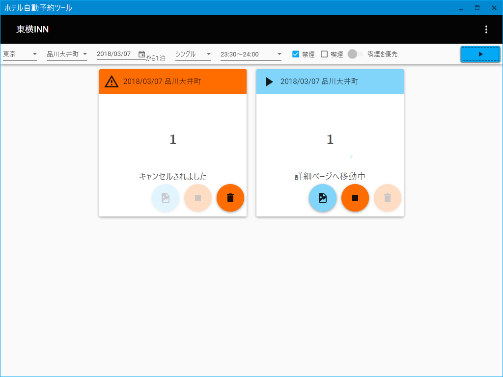

# ホテル自動予約ツール

## Overview
ホテルの予約を自動で行うツールです。  
東横INNに標準対応しています。

## Requirement
* Windows 7 Professional (32-bit) / 10 Home (64-bit)
* .NET Framework 4.5.1 以上

## At First
初回起動時はメニューボタン（︙）の「予約設定」からアカウント設定を行って下さい。

## Usage
都道府県、ホテル、宿泊日、部屋タイプ、チェックイン時刻、禁煙・喫煙を設定し、実行ボタン（▶）を押下することで、指定した条件にて自動予約が開始されます。  

各プロセスは予約が完了するかキャンセルされるまで30秒に1回のペースで実行されます。また一定の条件で例外終了する場合があります。  

予約は全てバックグラウンドで実行されますが、スクリーンショットボタン押下でその時点の仮想キャプチャを確認することができます。  

目的のホテルがリストボックスに見当たらない場合はメニューボタンから「ホテル情報更新」を実施してみて下さい。  

## Limitations
アプリケーション仕様により、以下の制限事項が存在します。
- 宿泊日数は1泊のみとなります
- 宿泊人数は1名で予約されます
- 同じ部屋タイプで異なる種類の部屋（シングルA・Bなど）存在した場合は公式HPにて上部に記載の部屋から検索が行われます（禁煙・喫煙は考慮されます）

## Disclaimer
本ソフトウェアを用いていかなる損失を生じても当方では責任を負いかねますのでご了承ください。

## License
本ソフトウェアのライセンスは MIT License に従います。

## Contact Us
<dl>
    <dt>サイト</dt>
    <dd>http://minatopj.php.xdomain.jp/</dd>
    <dt>メール</dt>
    <dd>clannad.ilove.magister at gmail.com</dd>
</dl>

## History
| Revision   | Updates         |
|:----------:|:--------------- |
| 2018.5.7.0 | サイトの更新に対応 |
| 2018.3.5.0 | Release         |
